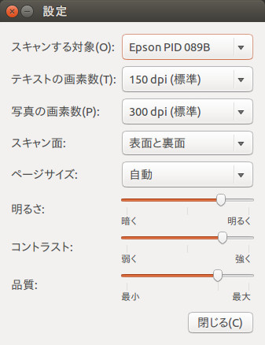

###データセットの作り方をメモしておくよ
####1 紙の準備
* `<lec_h2o>/dataset/sheet`内の**hira.pdf**をたくさん印刷
* **hira.pdf**にひらがなを書きまくる

####2 スキャンと画像の前処理
* 記入の終わったものをスキャンしまくる
* 一旦GIMP等を用いて2値化を施す
* 処理済みのスキャン画像を`<lec_h2o>/dataset/scan`に移動

#####※シンプルスキャンの設定
こう！



####3 分割のプログラムの実行
* `<lec_h2o>/dataset`内で
```bash
mkdir out
cd out
mkdir pgm
mkdir temp
```

* `<lec_h2o>/dataset`内で
```bash
perl glyphsplit.pl scan/<image>.png code/_hira3.txt <x ofset> <y_ofset>
```
→`out/pgm`にたくさん画像が置かれる(95×95pixel)


* 出力されるpgmファイルを確認
微妙→[x ofset]と[y ofset]の値を調整し、再度コマンドを叩く
よさ気→次のステップへ

* `out/pgm`の中身を`out_train`の中に移動

####4 集まったデータをcsvファイルに書き出す
* `<lec_h2o>/dataset`内で
```bash
./csv_writer
```

###※3,4の作業を行うスクリプトの実行
```bash
cd <lec_h2o>/dataset
bash god.sh [ファイル名.png] [x_ofset`] [y_ofset]
```